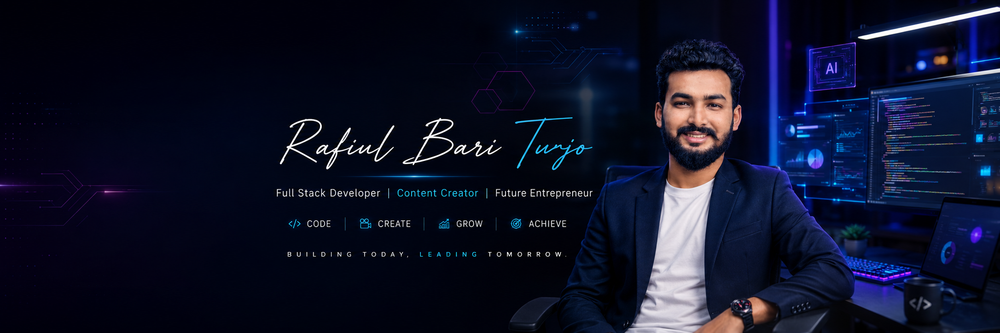

<h1 align="center">
  
   

  

  

  
</h1>

---

## 👨‍💻 About Me

I'm **Rafiul Bari Turjo**, a passionate **Junior MERN Stack Developer** from **Bangladesh 🇧🇩**.

I enjoy building modern, responsive, and scalable full-stack web applications using the MERN stack. I'm continuously learning new technologies, solving coding problems, and creating real-world projects that improve my development skills.

- 🔭 Currently building **AI-powered Full Stack Applications**
- 🌱 Learning **Next.js, React Native (Expo), AI Integration & System Design**
- 💬 Ask me about **React, Next.js, Node.js, Express.js, MongoDB**
- 🎯 Goal: Become a skilled Software Engineer and contribute to impactful products
- ⚡ Fun Fact: I love turning ideas into real-world applications 🚀

---

## 🚀 Current Activities

- 💻 Building full-stack MERN applications
- 🤖 Developing AI-powered web applications
- 📚 Practicing Data Structures & Algorithms
- 🌱 Learning React Native (Expo) and Next.js
- 🎯 Preparing for Junior MERN Stack Developer opportunities
- 🚀 Improving problem-solving and system design skills

---

## 📫 Connect With Me

---

# 💻 Tech Stack

## 🎨 Frontend

---

## ⚙️ Backend

---

## 🗄️ Database

---

## 🛠️ Tools & Platforms

---

## 📖 Currently Learning

---

# 🚀 Featured Projects

| Project | Description | Tech | Live |
|---------|-------------|------|------|
| 🏋️ Vigor | AI-powered Fitness & Gym Management Platform | MERN Stack | [🔗 Live](https://vigor-client.vercel.app/) |
| 🤖 AI Mock Interview | AI Interview Practice & Evaluation Platform | Next.js, AI, MongoDB | [🔗 Live](https://ai-mock-interview-rust-one.vercel.app/) |
| 📚 Book Borrowing System | Book Borrowing Management Platform | React, Express, MongoDB | [🔗 Live](https://book-borrowing.vercel.app/) |
| 🚗 Dreams Car | Car Booking & Management Platform | MERN Stack | [🔗 Live](https://dreams-car-client.vercel.app/) |

---

# 📊 GitHub Stats

 

---

# 📈 Contribution Graph

---

# 🤝 Let's Connect

I'm always interested in collaborating on exciting projects and connecting with fellow developers.

💼 Open to **Junior MERN Stack Developer**, **Frontend Developer**, and **Full Stack Developer** opportunities.

⭐ Thanks for visiting my profile! Have a great day!
